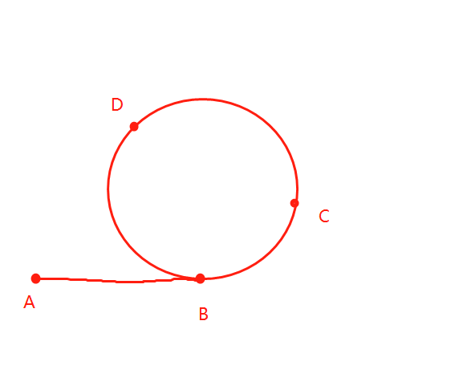

## 例子

##### 1.判断链表是否有环
  

1.快慢指针(a:v=2,b:v=1)法  
A为起点，B为入环点，C为快慢指针重合   

重合时，b走n步，a走n+环长 步  
并且a的路程为b路程的两倍  
如果遍历结束之前，a,b相遇，则存在环  

##### 2.找到入环点  
2(AB+BC)=AB+BC+n(环长)  
AB=(n-1)环长+CB  
所以把b指针放在c和a，每次走一步，相遇点就是入环点   

